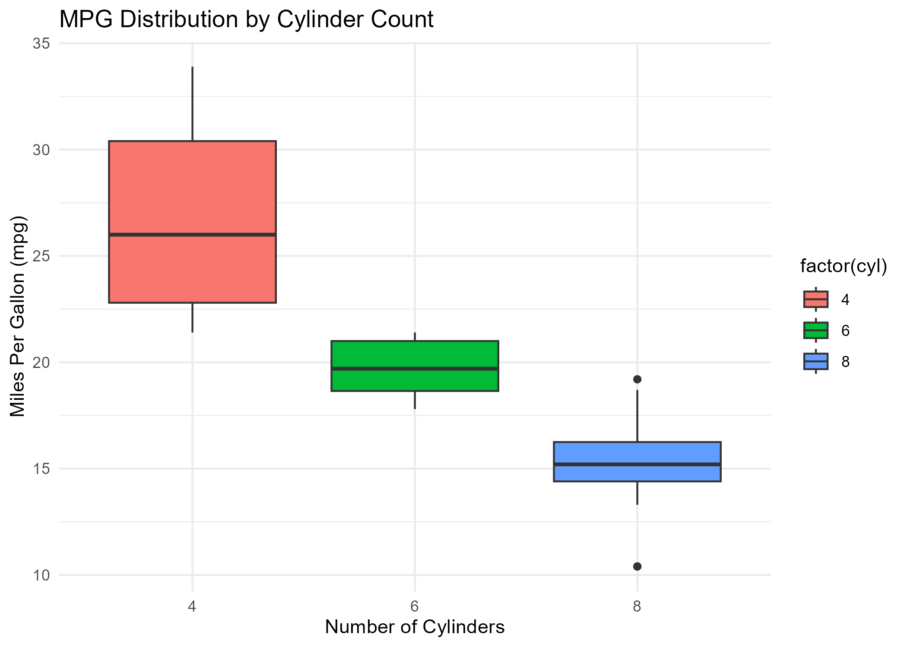

# 🚗 MTCars Data Analysis

This project analyzes the classic `mtcars` dataset in R to explore relationships between car performance metrics such as **miles per gallon (mpg)**, **horsepower (hp)**, **weight (wt)**, and **number of cylinders (cyl)**.

The project demonstrates:
- Data cleaning and exploration
- Data visualization using `ggplot2`
- Building and evaluating a linear regression model
- Saving outputs and plots for further use

---

## 📊 Dataset

The dataset used is R’s built-in `mtcars` dataset, originally extracted from the 1974 Motor Trend US magazine.  
It contains fuel consumption and 10 aspects of automobile design and performance for 32 cars.

| Variable | Description |
|-----------|--------------|
| mpg | Miles per gallon |
| cyl | Number of cylinders |
| disp | Displacement (cu.in.) |
| hp | Gross horsepower |
| drat | Rear axle ratio |
| wt | Weight (1000 lbs) |
| qsec | 1/4 mile time |
| vs | Engine (0 = V-shaped, 1 = straight) |
| am | Transmission (0 = automatic, 1 = manual) |
| gear | Number of forward gears |
| carb | Number of carburetors |

---

## 🧠 Analysis Overview

1. **Data Preparation**
   - Added car names as a separate column
   - Performed summary statistics and inspection

2. **Visualizations**
   - Distribution of fuel efficiency (MPG)
   - Relationship between horsepower and MPG
   - Boxplot of MPG by cylinder count

3. **Modeling**
   - Built a linear regression model predicting MPG using HP, Weight, and Cylinders.
   - Evaluated model fit using correlation between predicted and actual MPG.

---

## 📈 Visualizations

Here are the generated plots from the analysis:

### MPG Distribution


### Horsepower vs. MPG


### MPG by Cylinder Count


---

## 🧰 Tools and Libraries

- **R (v4.5.0+)**
- **tidyverse** (data cleaning & visualization)
- **ggplot2** (plots)
- **dplyr** (data manipulation)

---

## 📂 Project Structure


---

## 👨‍💻 Author

**Baraka Mitigoa**  
*Data Science & Computing Enthusiast*  
[GitHub: @bmitigoa](https://github.com/bmitigoa)

---

## 🏁 How to Run

To reproduce this analysis:

```r
# 1. Open mtcars_analysis.R in RStudio
# 2. Run all code blocks
# 3. View the generated plots and outputs
